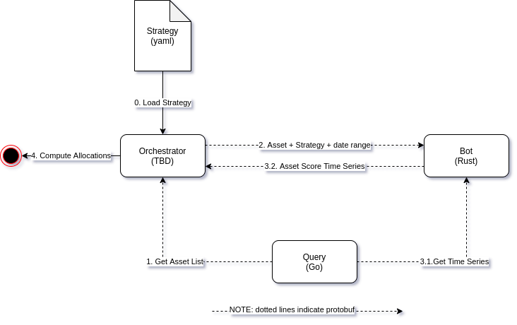
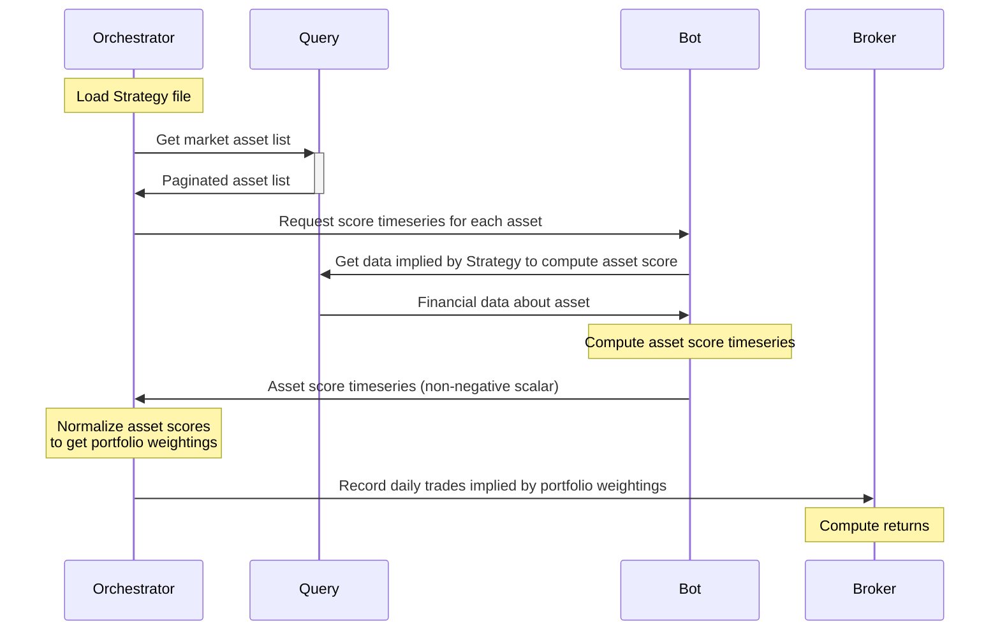

# Luckless

Luckless is a simple extensible algorithmic trading platform for individual investors.  It consists of 3 containerized microservices (written in **Go**, **Java**, and **Rust**) which use **grpc**/**Protobuf** for messaging and **Postgres** for persistence.

## Features

- [Declarative Asset Allocation](#strategy-dsl): define stock picking strategy with extensible yaml
- [Back-test Runtime](#back-test-runtime): execute strategy against historic data

## Strategy DSL
  
Example [Strategy file](https://github.com/luckless-finance/bot/blob/develop/strategy.yaml)

## Back-test Runtime

0. Orchestrator loads Strategy file
1. Orchestrator gets list of all Assets in market from Query service
2. For each Asset, Orchestrator requests Asset Score Time Series from Bot
3. Bot executes Strategy directed acyclic graph (DAG) for each Asset
   1. Bot requests Time Series from Query as specified in Strategy
   2. Bot computes Asset Score Time Series
4. Orchestrator aggregates Asset Scores over Assets for each day to get allocation Time Series

## Services

- [*Bot*](https://github.com/luckless-finance/bot) (Rust)
  - executes Strategy to determine non-negative Asset Score
  - consumes market data provided by Query service GRPC/Protobuf
- [*Query*](https://github.com/luckless-finance/query) (Golang)
  - written in Go
  - implements GRPC-based query.proto service
  - exposes Quandl market data to other services
- [*Broker*](https://github.com/luckless-finance/broker) (Java + Quarkus)
  - provides mock brokerage account API
- Orchestrator
  - parses a Strategy yaml and handles any parametrization
  - sends 1 Asset Score request per Asset to Bot
  - aggregates Asset Scores to get Asset allocations

> [shared resources](https://github.com/luckless-finance/shared)  |  [docs](https://github.com/luckless-finance/docs)

## Future Work

- Real World Deployment: (long term) automate trade ordering of the real world portfolio

## Abandoned Attempts

- [pyyafa (python)](https://github.com/grahamcrowell/pyyafa) 
- [yafa-bot-archived (java)](https://github.com/grahamcrowell/yafa-bot-archived)
